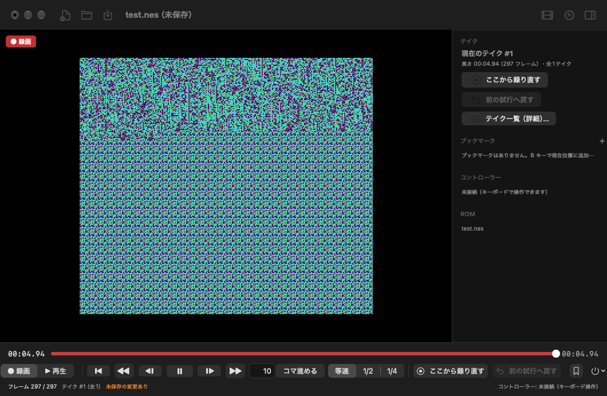

English | [日本語](README.ja.md)

# ReplayNES

**Made a mistake? Go back and record it again. What you end up with is a flawless, no-miss run.**

ReplayNES is an NES / Famicom emulator for macOS. It records your play not as video but as
a history of inputs, so you can rewind to any moment you like and re-record from there.
When you play the finished take from the beginning, the failed parts are gone and it plays as one continuous run.
You can export it as-is to an MP4 with audio.



## Features

- **ROM Library**: ROMs placed in `~/Documents/ReplayNES/ROM` are listed by game name (a built-in database of NES / Famicom titles with maker, year and genre; Japanese titles in gojūon order in the Japanese UI), with favourites, recently played and sorting; pick one to start playing. Projects are saved automatically to `~/Documents/ReplayNES/Projects`, and "Continue" picks up the last session.
- **Flash Reduction (care for flashing lights)**: Detects scenes where the whole screen flashes intensely and tones down only what is displayed (on by default). It does not affect game progress or recording.
- **Rewind and re-record**: You can go back to any frame. If you play from there, it becomes a new take, and the previous take is kept rather than erased.
- **Practice Mode (A/B Repeat)**: Mark a tricky section with A and B and practice it over and over without recording. Up to 8 sections are saved per project.
- **Controller-only operation**: L+R together opens the Quick Menu (everything else is there, no page ever scrolls; even button remapping works with the controller alone), L2 rewinds, R2 fast-forwards, R pauses, L slows down; while paused L / R and the D-pad step frame by frame and A/B practice markers are dropped and moved on the seek bar. The controller works even when ReplayNES is not in front (for example while you are operating OBS).
- **Even Tetris-style randomness is reproduced exactly**: Playback is recomputed from "the console state + the input for every frame", so you get exactly the same result as when you recorded.
- **Production aids**: Pause, frame advance, advance by N frames, 1/2 slow motion, timeline seeking, bookmarks, soft reset, and power cycling. None of these count toward the final take's duration, and playback is always at normal speed.
- **Turbo**: Set the cycle and press duration of A/B turbo in frames. What is recorded is the input after turbo has been applied.
- **Pick up the next day**: If you save the project (`.nesrec`), you can open it later and still rewind even further into the past. Autosave and crash recovery are supported, and even if you quit the app (including a force quit), it automatically picks up where you left off at the next launch.
- **MP4 export**: The video is redrawn offline based on in-game time, so dropped frames during play do not affect it. Pixels are scaled up with nearest-neighbor, and you can specify overscan cropping and the pixel aspect ratio (1:1 / 8:7).
- **Low latency**: Rendering uses Metal, and the audio buffer is kept small. There is also a latency measurement display (⌘L).
- **Automatic updates**: New versions are checked from GitHub Releases, and the signature (EdDSA) is verified before updating (using [Sparkle](https://sparkle-project.org)). You can also check from the menu via "ReplayNES → Check for Updates…".

## System Requirements

- macOS 14 or later, Apple Silicon (arm64)
- A keyboard, or a game controller that macOS recognizes (GameController.framework supported)
- Game ROM files (`.nes`) are not included. Please use ones you have legally prepared from games you own.

## Installation

1. Download `ReplayNES-<version>-macOS-arm64.zip` from [Releases](https://github.com/kathoc/ReplayNES/releases) and unzip it.
2. Move `ReplayNES.app` to the "Applications" folder.
3. Because it has not been notarized, launch it the first time with **right-click → "Open"**. If it still will not open, choose "Open Anyway" in "System Settings → Privacy & Security".
4. On the second launch you will be asked "Automatically check for updates?". After that, updates can be done inside the app (0.1.2 and later; from 0.1.1 or earlier, replace the app manually). In Settings › System › Updates, you can turn automatic checking and automatic installation on or off at any time.

## Steam Deck / Linux (preview)

ReplayNES also runs on Steam Deck (SteamOS 3, Gaming Mode and Desktop Mode) and other x86_64 Linux systems as a Flatpak (`io.github.replaynes.ReplayNES`), with the same projects and features: library, rewind and re-record with takes, filmstrip timeline, practice (A/B), bookmarks, autosave and resume, flash reduction, the CRT display, MP4 export, English / Japanese. Full guide: [docs/STEAM_DECK.md](docs/STEAM_DECK.md).

1. **Install** (Desktop Mode, Konsole): `flatpak install --user https://kathoc.github.io/ReplayNES/flatpak/io.github.replaynes.ReplayNES.flatpakref` (the signed ReplayNES repository on GitHub Pages; the runtime comes from Flathub), or download `io.github.replaynes.ReplayNES-<version>-x86_64.flatpak` from [Releases](https://github.com/kathoc/ReplayNES/releases) and run `flatpak install --user io.github.replaynes.ReplayNES-<version>-x86_64.flatpak` (it registers the same repository). Nothing is installed into the read-only SteamOS system. **Updates**: the app shows "A new version of ReplayNES is available" on the library; Settings › System › Updates has Update → Restart and "Check Now"; `flatpak update` works too. In Gaming Mode the system cannot ask for the one-time update permission: update once in Desktop Mode, or run `flatpak permission-set flatpak updates io.github.replaynes.ReplayNES yes` ([details](docs/STEAM_DECK.md#updates)).
2. **Add to Steam**: in Desktop Mode, close Steam, then run ReplayNES and choose Settings › System › **Add to Steam** (or `flatpak run io.github.replaynes.ReplayNES --add-to-steam`): it adds ReplayNES to the Steam library with its own capsule / hero / logo / icon artwork ([details](docs/STEAM_DECK.md#add-to-steam-with-artwork)). Or the Steam way: Steam → Games → "Add a Non-Steam Game to My Library…" → tick ReplayNES. Start it from the library in Gaming Mode (it opens full screen). On the OLED model, 60 Hz (Quick Access → Performance) gives the most even motion.
3. **ROMs**: put `.nes` files into `~/Documents/ReplayNES/ROM` (e.g. with Dolphin in Desktop Mode). The start screen is the library: a "Continue" card for the last session (also after a crash), then large game cards with the game's name, maker and year - the confirm button (B) plays (a new project in `~/Documents/ReplayNES/Projects`), Y marks a favourite, X lists a game's projects, View (⧉) changes the sort; up from the cards reaches All / Favorites / Recent, the sort and the search.
4. **Controls** (Steam Input's default gamepad layout): D-pad / left stick = NES D-pad, B / A = NES A / B, Y / X = turbo A / B, Menu / View = START / SELECT, **L+R together = Quick Menu, R = pause (the seek bar), L = slow 1/2, L2 hold = rewind, R2 hold = fast-forward**. In menus **B (east) confirms and A (south) goes back** (Settings › Controls › Confirm Button swaps them).
5. **The Quick Menu: press L and R together** (within 0.1 s, either order; or tap the "☰ Menu L+R" pill in the top-right corner, which is always there). The game pauses, dimmed behind six tiles: Resume, Retry (record from here, previous try, takes, bookmarks, watch), Practice (the 8 A/B sections as cards), Share (MP4 export), Settings (Display / Controls / Sound / System, L / R switch) and Game (choose game, save, save as, open, reset). Nothing scrolls; the focused item has a red frame, one line at the bottom says what it does and the buttons of your controller are shown at the bottom right.

   | Button | In play | Paused (seek bar) | In menus |
   |---|---|---|---|
   | L+R together | Quick Menu (pauses) | Quick Menu | close it (resume) |
   | R alone | pause: only the seek bar shows | step 1 frame forward (hold: repeat) | next page |
   | L alone | slow 1/2 on / off | step 1 frame back (hold: repeat) | previous page |
   | L2 / R2 hold | rewind / fast-forward (the same speed, both speed up) | rewind / fast-forward | rewind / fast-forward |
   | D-pad / left stick | NES D-pad | ← / → step, ↑ to the A/B markers | move the focus |
   | B (east) | NES A | drop an A/B marker | confirm |
   | A (south) | NES B | **resume** (tap) | back (on the top level: resume) |
   | Y / X | turbo A / B | Y: next A/B slot · X: delete the focused marker | what the hint bar shows (rename, clear, favourite, projects …) |

   L or R alone acts when it is **released**, so a single press never gets in the way of L+R. Confirm / back follow Settings › Controls › Confirm Button (B confirms by default; the game's buttons never change). Paused, the buttons are taps: hold one (say A to run) and step with → or R to advance frames with it held - it only resumes / drops a marker when tapped alone. Menu (≡) stays START while playing (games need it). Touch and the trackpad work on every screen too.

   **Typing (search, names)**: a text field brings an on-screen keyboard. In Gaming Mode ReplayNES asks Steam for its keyboard (it can type Japanese); if it does not appear, press the confirm button for ReplayNES's built-in controller keyboard (confirm types, back deletes, X space, Y Shift, L1 / R1 move the cursor, View (⧉) symbols, Menu (≡) done). Settings › Controls › On-screen Keyboard: Automatic, Built-in or Steam.

Japanese text uses the system's CJK font (SteamOS has one). While you play only the Menu pill is drawn (in the game's own render pass), so the UI does not add latency.

## Windows (preview)

ReplayNES runs on Windows 10 / 11 (x64 and ARM64) as a portable app with the Steam Deck / Linux version's interface: library, rewind and re-record with takes, filmstrip timeline, practice (A/B), bookmarks, autosave and resume, flash reduction, the CRT display, MP4 export, English / Japanese, display-locked low-latency pacing (Direct3D 11). Details: [docs/WINDOWS.md](docs/WINDOWS.md).

1. **Install**: unzip `ReplayNES-<version>-windows-x64.zip` (`-arm64` for Windows on Arm) into a folder you can write to (e.g. under your user folder, not `Program Files`) and run `ReplayNES.exe` (no installer; `WinSparkle.dll` next to it is the updater). Not code-signed yet: SmartScreen may ask once ("More info" → "Run anyway").
2. **ROMs**: put `.nes` files into `Documents\ReplayNES\ROM` ("Open Folder" in the library opens it in Explorer). "Play" starts a project in `Documents\ReplayNES\Projects`. The temporary session lives in `%LOCALAPPDATA%\ReplayNES\Session`, settings in `%APPDATA%\ReplayNES`. Reset Project / Save As move replaced projects to the Recycle Bin.
3. **Controls**: Xbox-style controllers (XInput / GameInput), PlayStation and Switch Pro controllers, with the same assignments as on the Steam Deck (A = NES B, B = NES A by position, Menu / View = START / SELECT, L+R together (LB+RB, L1+R1) = Quick Menu, R = pause, L = slow, L2 / R2 hold = rewind / fast-forward); keyboard: arrows, X / Z, Enter, right Shift, Space pause, Backspace rewind, Tab fast-forward, Esc / F1 Quick Menu, F11 full screen. Without a controller, the "☰ Menu Esc" pill (top right) is a button too. Everything is reassignable in Settings.
4. **Display**: F11 / Settings › System › More › Full Screen (borderless). For G-SYNC / FreeSync displays, `ReplayNES.exe --vrr` presents with tearing allowed at the NES's own 60.0988 Hz in full screen. Settings › Display › CRT turns on the physical CRT model (Direct3D 11 compute; needs a Direct3D 11.0 GPU).
5. **MP4 export**: Quick Menu › Share › Export MP4 (H.264 + AAC through Windows' Media Foundation; a hardware encoder when the GPU has one), saved in `Documents\ReplayNES\Exports`.
6. **Updates**: ReplayNES checks GitHub for a new version once a day if you agree when it asks (on the second launch), or right away with Settings › System › Updates › Check Now. The update is downloaded, its signature checked, and ReplayNES restarts into the new version (the session is saved first). "Check Automatically" turns the daily check off.

## Usage

### The Screen

ReplayNES has one window. While you play, only the game is on screen, plus a small **"☰ Menu L+R"** pill in the top-right corner (it shows "Esc" when no controller is connected, "L1+R1" for PlayStation controllers). Everything else is in the **Quick Menu** and in the menu bar.

- **Library** (start screen, Game › Choose Game… ⇧⌘L): see "Library" below.
- **Quick Menu**: press **L and R together** (within 0.1 s, either order), press **Esc**, or click the pill. The game pauses, dimmed behind six tiles. Press L+R / Esc again (or choose Resume) to keep playing.
- **Paused (R / Space / ⌘P)**: only the filmstrip seek bar with the time appears at the bottom; nothing else covers the game.
- **Menu bar**: Game (library, new / open / save, reset, close), Retry, Practice, Share, View (FILL ⌘F, Full Screen ⌃⌘F, latency ⌘L), Window (Close ⌘W) and Help › Controls (⌘?). ⌘, opens the Quick Menu's settings.

### The Quick Menu

| Tile | What is in it |
|---|---|
| **Resume** | Close the menu and keep playing (focused when the menu opens) |
| **Retry** | Record from Here · Previous Attempt (⌥⌘Z) · Watch Replay / Back to Recording (⇧⌘M) · Takes (⇧⌘T) · Bookmarks · Restart Recording (the Reset Project confirmation) |
| **Practice** | The 8 A/B sections as cards (see "Practice Mode") |
| **Share** | Export MP4 (⌘E) · Stream Output (Syphon, for OBS) |
| **Settings** | Four pages, L / R (or Tab) switch: **Display** (Size Integer / FILL, CRT, 8:7, Reduce Flashing, Hide Edges, CRT Details), **Controls** (Controller diagram, Keyboard, Confirm Button, D-pad While Paused, Pause After Rewind, Controls Details), **Sound** (Volume), **System** (Language, Autosave, Latency Meter, Flash Notice, Updates, About) |
| **Game** | Choose Game · Save · Save As · Reset (Soft Reset, Power Cycle, Start Over) · Close |

No page scrolls: a page shows at most six items, longer lists (takes, bookmarks, key assignments) are split into pages switched with L / R. The focused item has a red frame, one line at the bottom says what it does, and the bottom right shows the buttons of your controller (or keys). The mouse and trackpad work everywhere too.

| Button | In play | Paused (seek bar) | In menus |
|---|---|---|---|
| L+R together / Esc | Quick Menu (pauses) | Quick Menu | close it (resume) |
| R alone | pause (the seek bar) | step 1 frame forward (hold: repeat) | next page |
| L alone | slow 1/2 on / off | step 1 frame back (hold: repeat) | previous page |
| L2 / R2 hold | rewind / fast-forward (the same speed) | rewind / fast-forward | — |
| D-pad / left stick | NES D-pad | ← / → step, ↑ to the A/B markers | move the focus |
| East button (B / Xbox, A / Nintendo, ○) | NES A | drop an A/B marker | confirm |
| South button (A / Xbox, B / Nintendo, ✕) | NES B | **resume** (tap) | back (on the top level: close) |
| Y / X | turbo A / B | Y: next A/B slot · X: delete the focused marker | what the hint bar shows (rename, clear, favourite, projects …) |

Keyboard: Esc opens / closes the Quick Menu, Space pauses / resumes; in menus the arrows move, Return / Space confirm, Delete goes back, Tab / ⇧Tab switch pages. L or R alone acts when it is released, so it never gets in the way of L+R. Settings › Controls › Confirm Button swaps the controller's confirm (east) and back (south). The Quick Menu is an assignable action (Settings › Controls › Keyboard): pad 1's L+R and Esc by default.

### Library

ReplayNES creates these folders at launch (the first time, macOS asks for access to the Documents folder: choose "Allow").

| Folder | Contents |
|---|---|
| `~/Documents/ReplayNES/ROM` | Your own ROMs (`.nes`). Subfolders one level down are read too |
| `~/Documents/ReplayNES/Projects` | Projects started from the library (`<ROM name> <yyyy-MM-dd HHmm>.nesrec`) |

- ReplayNES always starts here. At the top, a large **Continue** card reopens the last session where you left off (a project, or a game played without one), also after a force quit or a crash (from the last autosave); with none, it opens your latest project. Below it, big game cards (thumbnail of the latest project), paged with L / R instead of scrolling.
- **Game names**: a built-in database (titles, makers, release years and genres of NES / Famicom games from Wikidata, matched by the ROM's contents or its file name) shows each game by its name in the UI language, with "maker · year" under it and the genre in the line at the bottom. In Japanese, games are listed in gojūon order of their kana reading ("FRONT LINE" sorts as フロントライン); ROMs it doesn't know keep their file name and come after.
- **Sort and filter**: the row at the top: **All / Favorites / Recent** (the games you played last, with when and for how long), the sort (**Name / Last Played / Maker / Year / Genre**; View (⧉) or S cycles it) and the search (/). **Y** marks the focused game as a favourite (a star) or removes it. Favourites, the history and the order are kept in `~/Library/Application Support/ReplayNES/library.json`.
- **A / Return / double-click** plays the focused game: a new project is created (no save dialog) and the game starts right away; your work is saved automatically.
- **X** lists that game's projects ("New Game" starts another one); projects are matched to ROMs by their contents (SHA-256), so renaming the ROM file keeps the match. With no ROMs yet, one card shows where to put them ("Open Folder"). Additions and deletions are picked up automatically.
- Game menu: New Project… (⌘N: choose where to save), Open Project… (⌘O), Try a ROM (No Project)… (⇧⌘N: play without a project; resumes at the next launch).
- Choosing another game while one is open asks whether to save unsaved changes (see "Resume" below).

### Recording and Watching

- ReplayNES records from the moment a game starts. **Retry › Watch Replay** (⇧⌘M) plays the recorded take without recording: from the start if you were at its end, otherwise from where you are. It pauses at the end.
- **Retry › Back to Recording** (or Record from Here) returns to record mode at that position. The next input continues the recording; partway through, it branches into a new take and the original continuation is kept.
- **Size**: "Integer" is the largest integer scale that fits (crisp pixels); "FILL" fills the window keeping the aspect ratio (4:3, or 8:7 pixels). Settings › Display › Size or View › FILL (⌘F); saved.
- **Seek bar (filmstrip)**: one screenshot per 5 seconds of play at its natural size (then one per 10 s, 20 s, … as the take grows). Drag to move (silent, paused). The playhead (red recording, white playing, orange practicing), bookmarks (yellow) and A/B sections (numbered colored bands) are overlaid. Thumbnails are made apart from the game (in parallel, from the take's checkpoints), so even a one-hour take shows them shortly after it opens.

### Flash Reduction (care for flashing lights)

It detects scenes such as explosions and lightning where **a wide area of the screen flashes intensely** and tones down only the displayed picture (fewer flashes, keeping the darker side). It uses the WCAG 2.x general flash and red flash thresholds (no more than 3 flashes per second over about 25% or more of the screen) as a guide.

- Settings › Display › **Reduce Flashing**: **Off / Low / Standard / High**. The default is **Standard (on)**.
  - Low: exactly the WCAG threshold (up to 3 times per second)
  - Standard: detects early, up to 2 times per second (recommended)
  - High: up to 1 time per second. It also weakens small remaining flicker
- Small flashes (such as a character blinking) and normal scrolling are shown as they are. While it is reducing, "Flash Reduction Active" is shown at the top left (Settings › System › Flash Notice hides it).
- It has no effect at all on recorded input, game progress, or reproducibility (hashes). It is display-only processing.
- When exporting to MP4, "Apply Flash Reduction" applies it to the exported video as well (the initial value follows the current setting).

> **Note**: This feature does not reliably prevent photosensitive seizures or the like. If you are sensitive to flashing, please take sufficient care, and stop playing immediately if you feel anything unusual. See [docs/FLASH_REDUCTION.md](docs/FLASH_REDUCTION.md) for how it works and its limits.

### Controller and Key Assignments

Controller buttons are assigned by **position** (right button = Famicom A, bottom button = B). On Nintendo controllers, A = A and B = B as printed.

| Action | Controller (position) | Pro Controller / Joy-Con | Xbox | PlayStation | Keyboard |
|---|---|---|---|---|---|
| D-pad | D-pad / Left Stick | | | | ← ↑ → ↓ |
| A / B | Right / bottom button | A / B | B / A | ○ / ✕ | X / Z |
| Turbo A / Turbo B | Top / left button | X / Y | Y / X | △ / □ | S / A |
| START / SELECT | Menu / Options | + / − | ≡ / View | OPTIONS / CREATE | Return / Right Shift (or `\`) |
| Quick Menu | **Left + Right Shoulder together** | L + R | LB + RB | L1 + R1 | Esc |
| Rewind (while held) | **Left Trigger** | ZL | LT | L2 | Delete |
| Fast-forward (while held) | **Right Trigger** | ZR | RT | R2 | Tab |
| Pause / Resume | **Right Shoulder** | R | RB | R1 | Space |
| Slow 1/2 ⇔ normal speed | **Left Shoulder** | L | LB | L1 | L |
| Step back / frame advance while paused | **L / R** or **D-pad ← / →** (hold for continuous) | | | | `,` / `.` |
| Bookmark | — | | | | B |

- **Settings › Controls › Controller** shows a diagram of the connected controller (Steam Deck / Nintendo / Xbox / PlayStation / other outlines) with each button's assignment; pressing a button lights it up. Everything works with the controller alone: move the red ring over a button with the D-pad or stick, confirm, and pick its action (a Famicom button, turbo, a hotkey or nothing) from pages of six (L / R turn the pages, back cancels); X switches pads, Y restores that pad's defaults. **Keyboard** lists every action with its keys (confirm, then press the new key; back / Esc cancels; X clears). **Controls Details**: opposite directions (←+→), stick threshold, turbo press length, Default Buttons.
- Rewind, fast-forward, pause, slow, frame advance and the Quick Menu are "hotkeys" and are never recorded as game input.
- **While paused**, L / R and the D-pad ← / → step frames (not sent to the game; Settings › Controls › D-pad While Paused turns the D-pad part off), and **a tap of the back button (A / south) resumes**. Other buttons still reach the game, so you can hold a button (say B to run) and step with → to advance frames with it held; a button held through a step never resumes or drops a marker. Frame stepping only moves along the take: before its end it plays the recorded input and never starts a new take; only at the end of the take does each step record one more frame (with the buttons you hold). To record differently from an earlier point, resume play there.
- **Fast-forward** just plays the recorded take at high speed and records nothing; it stops and pauses at the end of what is recorded.
- **Background input**: while a controller is connected, input is accepted even when ReplayNES is not in front (for example while operating OBS), and the sound keeps playing. The keyboard works only while ReplayNES is in front. If the controller is disconnected, the game pauses.
- **Updating from older versions**: saved assignments are upgraded once, and only the parts you never changed: 0.1.x controller hotkeys → the current ones; up to 0.2.x the triggers were swapped (R2 rewind); up to 0.2.0 A / B and X / Y were swapped on Nintendo controllers (customised face buttons are carried over when that controller connects); 0.5.0 adds the Quick Menu (pad 1's L+R and Esc, unless Esc was already assigned). R keeps pausing and L keeps slowing down. Older versions cannot read the assignments file once a newer one has added the Quick Menu.

### Rewind and Re-record

1. If you make a mistake, **hold L2 (or Delete) to rewind**, or drag the seek bar to go back.
2. Play on from there and a new take is recorded from that position. The original continuation is kept.
3. If the previous take was better, **Retry › Previous Attempt** (⌥⌘Z) brings it back. **Retry › Takes** (⇧⌘T) lists every take; choose one to switch to it.
4. **Bookmarks** (B / ⌘D, or Retry › Bookmarks › Add Here) mark a moment; choose a bookmark to jump to it (Y renames, X deletes).

**Game › Reset › Start Over** (also **Retry › Restart Recording**, and the Game menu: Start Over…) starts the project over from power-on with an empty timeline: every take, bookmark and the take history are deleted; the ROM and the project location stay. "Keep A/B repeat sections" (on by default) keeps your practice sections. A saved project is first backed up to the Trash, so the old recording can still be recovered from there.

### Production Aids

- Pause (R / Space / ⌘P), frame advance (D-pad → while paused / `.` / ⌘→), step back (D-pad ← / `,` / ⌘←), 1 second back / forward (⌘[ / ⌘]), go to start (⌘↑).
- Slow: 1/2 ⇔ normal speed (L / ⌘2). Slow motion and pausing are not counted in the final take's duration.
- Soft reset (⌘R) and power cycle (⇧⌘R) (Game › Reset) record which frame they were done on, and are reproduced on the same frame during playback.
- No sound is produced while paused, rewinding, seeking, in slow motion, or fast-forwarding.

### Practice Mode (A/B Repeat)

Practice only the tricky section over and over without recording.

1. Open **Quick Menu › Practice** (⇧⌘P): the 8 sections are cards. At the start of the section, choose **Set A Here** on an empty card.
2. Choose the card to practice from A. Play to where the section should end, open the menu and choose **Set B** on that card (outside practice: play on from A and use Practice › Set B Here (Timeline), ⌥⌘O). Each section shows its length (minutes:seconds.frames); Y renames, X clears.
3. Choose a finished section to **practice** it: play starts at A, and **at B the picture holds for 0.5 seconds (the sound fades out naturally), then goes back to A as if rewinding and starts again**.
4. While practicing you can also use L2 rewind (back to A), R pause, L slow, and the D-pad frame advance / step back while paused.
5. **Stop Practicing** (on the active card, or ⇧⌘P) returns you exactly to the position in the take from before you started.

- Nothing is recorded during practice. The take does not change.
- Set B at a position you reached by playing on from A. If you rewound, moved on the seek bar or switched takes after A, a message says so (start over from A, or set A again).
- Sections are saved in the project (autosave included). If a section's data is damaged, you can choose "Discard Damaged Sections and Open" when opening (takes are not affected).
- During practice, seeking, bookmarks and switching takes are unavailable.

#### A/B on the seek bar

For a recorded take, you can define sections without playing again. While paused, the seek bar has a band for the A/B sections and a section picker ("A/B 1") at its right.

- **Drag** on the band to make that range the A→B of the selected section (on the thumbnails, **Shift+drag**). **Drag either end** to adjust A / B; **click a section** to practice it.
- **Practice › Set A Here (Timeline)** (⌥⌘I) / **Set B Here (Timeline)** (⌥⌘O) at the playhead. Set B works without playing on from A, as long as A is on this take.
- Only sections on the current take are shown. Sections cannot be set while practicing.
- **With a controller** (paused): the selected section ("A/B 1", Y picks the next) shows as flags on the seek bar. Confirm (B / east) drops a flag at the playhead - the first is A, the second makes the section (the left flag is A, the right one B). ↑ moves to the flags (← / → pick one, ↓ or back returns); confirm on a flag moves it: ← / → one frame, L / R held move it like rewind / fast-forward while the picture follows; confirm keeps it, back undoes it. A flag passing the other one swaps A and B. X deletes the focused flag (one of two left: the section becomes "A only").

### Pick Up the Next Day

Save with **Game › Save** (⌘S) and open it later with **Open Project** (⌘O), the library's Continue card or the game's projects (X): you continue from where the last-used take left off, and can still rewind into the past. Your work is autosaved (every 2 seconds by default, Settings › System › Autosave; also right away when you pause and when the app goes to the background). If an abnormal exit is found when you open a project, it is recovered up to the last autosave and a message says so.

### Resume (Pick Up Where You Left Off, Even After Quitting)

- **Continue**: when you quit with ⌘Q or by closing the window (⌘W), you are not asked "Do you want to save?". Your work in progress is kept; the next launch starts on the library, and its **Continue** card opens the previous project (or the session you were playing without a project) **paused at the previous position and mode**, with "Resumed where you left off". After a force quit or power outage, Continue resumes from the last autosave (within a few seconds).
- **For projects**: on quit, only the project's autosave (journal) is written; what you saved with ⌘S does not change. When switching to another project or ROM, you are asked whether to save (choosing "Don't Save" returns to the last saved state).
- **Where temporary storage lives**: work done without a project (Try a ROM, or opening a ROM file directly) is stored at `~/Library/Application Support/ReplayNES/Session/current.nesrec` (resume information: `resume.json` in the same folder). The library's Continue card resumes it; save it anywhere with ⌘S to make it a normal project. Choosing another game while it waits there asks first whether to save it.
- **When it is discarded**: opening another ROM / project while the temporary session holds recorded content asks "Do you want to save?". "Save…" keeps it as a project, "Don't Save" discards it (the same applies to Game › Close). A temporary session with nothing recorded is discarded without asking.
- **When resuming fails** (the ROM was moved or deleted, a different core, a damaged file): the reason is shown and you return to the library; if the ROM can be specified again, you can do it right there. The temporary storage is **kept**, and Continue can try again.
- If you launch two copies of ReplayNES at the same time, the later one does not resume and does not touch the temporary storage.

If you moved the ROM file, specify it again when opening (it is confirmed to be the same ROM by SHA-256). **The ROM itself is not stored in the project.**

### Export to MP4 (⌘E)

Quick Menu › Share › Export MP4, or Share › Export MP4… in the menu bar.

- Format: H.264 or HEVC with AAC (48 kHz, 128 kbit/s mono)
- Bit rate: Light / Standard (YouTube) / High quality. Standard is YouTube's recommended upload rate for 60 fps SDR, chosen by the output height (1080p 12 Mbit/s, 1440p 24, 720p 7.5, 480p 4; between them interpolated by height², at least 1.5 Mbit/s; HEVC uses 70% of that); Light is half of it and High twice. The encoder uses this as its average rate (peaks up to 1.5×), and every choice in the export sheet shows its rate and an **estimated** file size for exactly this range, size and codec ("≈ 91 MB (estimate)"). The estimate is not a guarantee: the actual size depends on the picture. Detailed, busy pictures come close to it; simple pixel art and still scenes give much smaller files.
- Size: integer multiples of 256×240, 1280×960, 1920×1440, and so on
- You can choose overscan cropping and the pixel aspect ratio 1:1 / 8:7.
- With "Apply Flash Reduction", you can get a video with intense flashing toned down (see "Flash Reduction" above).
- Export recomputes everything from the beginning in a separate emulator. Exporting never changes the project, and you can keep working during export.

### Streaming (OBS)

The game screen is output via [Syphon](https://syphon.github.io) and can be brought directly into streaming software such as OBS (this is not a virtual camera).

1. In ReplayNES, open **Quick Menu › Share › Stream Output** and turn it on (or Share › Stream Output (Syphon) in the menu bar). While it is on, "Syphon Live" is shown at the top left of the game screen.
2. In OBS (macOS version), add "Source → ＋ → Syphon Client" and choose "[ReplayNES] ReplayNES" as the server.
3. For audio, add OBS's "macOS Audio Capture" source (captures an application's audio) and choose ReplayNES. No setting is needed on the ReplayNES side.

- Only the game screen is output (no UI, no pill or badges). Flash reduction is already applied just as in the display, and the entire 256×240 including the overscan area is enlarged with nearest-neighbor interpolation.
- The Stream Output page sets the size (native 256×240, 2x to 4x (default 4x, 1024×960), 1280×960 / 1920×1440 with black bars), the 8:7 pixel aspect ratio and whether the CRT picture is streamed (separate from the display settings).
- Output runs on a separate thread from emulation, and nothing is drawn when there is no receiver. A delay of a few frames may appear on the OBS side.
- While paused, the last picture keeps being shown.
- The controller works even when ReplayNES is not in front, so you can keep playing while operating OBS.

### Test Cartridge (no game needed)

ReplayNES comes with its own test program for the NES, the **ReplayNES Test Cartridge** (written for this project: code, graphics and font are our own; CC0 public domain). Add it to your library with **Add Test Cartridge** (the last button of the library's filter row, or on the empty library's card; it writes "ReplayNES Test Cartridge.nes" into the ROM folder once and selects it), or write it with `replaynes-cli make-test-rom --cartridge "ReplayNES Test Cartridge.nes"`. It also runs on other emulators and on real hardware (NROM-128). On the title screen, choose with Up/Down and open with A; in a test, Select goes to the next test and Start back to the menu.

- **Palette chart**: all 64 colours ($00–$3F) at once (the palette is rewritten between the rows), with the colour emphasis bits (A) and greyscale (B). Handy for checking the CRT picture and palette settings.
- **Color bars**: bars, a grey ramp and 1-pixel stripe / checker patterns for sharpness, with emphasis and greyscale.
- **Sprites**: 8 bouncing sprites, sprite-0 hit (move sprite 0 with the D-pad), the 8-sprites-per-line limit with the overflow flag, and flicker.
- **Scrolling**: horizontal, vertical, diagonal and D-pad scrolling over a 512×240 world, and a split screen whose status bar stays put.
- **Controllers**: both pads, all 8 buttons, live, with the raw bytes (Select+Start together to leave).
- **Rapid-fire meter**: see below.
- **Sound test**: pulse 1/2 (4 duties), triangle, noise (2 modes, 16 rates) and a scale.

#### Rapid-fire meter (連射測定)

A 10-second test for A and B (it starts with the first press), in the spirit of the classic 16-presses-per-second challenge, plus a turbo checker.

- **Presses** and **presses/s** (presses in the 10 s ÷ 10), and **edges**: every change of the button, press or release. 10 s are 600 frame samples, so at most 599 edges and 300 presses fit; any 60 samples hold at most 59 edges and 30 presses (**Best 1s P/E**).
- Mean and deviation of the press-to-press and release-to-release intervals, mean **hold** (press → release) and **gap** (release → press) with the **duty**, the last hold / gap, the fastest interval, a histogram of the press intervals, and the best 10 s record (kept until power-off). Intervals longer than 0.5 s count as pauses and stay out of the means.
- **Turbo check** (Left/Right): hold a turbo button to see its period (press to press), presses per second, hold / gap, duty, the range of the last 8 periods and a frame-by-frame trace — this shows exactly what ReplayNES's Turbo Speed and Turbo Press Length settings produce.
- Resolution: the cartridge reads the pads 4 times per frame (so on real hardware it catches taps shorter than a frame), but an emulator, ReplayNES included, changes the input once per frame: 1/60 s steps, at most 30 presses per second.

## About Core Compatibility (Important)

Recorded data depends strongly on "which emulator core plays it back". If the core version differs even slightly, the same inputs can give shifted results.
For that reason, each project records the core compatibility ID from when it was created (example: `nestopia-ue@7b5c87d8dc3c+p2+adapter1+ntsc`).

- A project with a different compatibility ID **will not open without a warning**. It will not be silently converted either.
- If the compatibility ID changes in a future version, we will either bundle the old core or provide an explicit migration procedure ([docs/COMPATIBILITY.md](docs/COMPATIBILITY.md)).
- For important projects, we recommend keeping them together with the version of ReplayNES used to create them.

## Privacy

ReplayNES connects to the network only when it accesses GitHub (github.com and its download servers) to check for and download updates.
All it sends are ordinary HTTPS requests to fetch the update information (`appcast.xml`) and the update file; it sends no system information, usage data, or the contents of ROMs or projects. There is no telemetry either.

- Automatic checking is enabled only if you allowed it in the prompt shown at the second launch (macOS and Windows; the Windows version fetches `appcast-windows.xml`).
- If you turn off "Automatically check for updates" in Settings › System › Updates, it does not connect except when you check manually from the menu.

What it reads and writes is limited to the ROMs and projects you specify, the Library folder (`~/Documents/ReplayNES`), settings files, and the update cache.

## Known Limitations

- Only NTSC (Japan / North America) timing is supported. PAL and the Famicom Disk System (FDS) have not been verified.
- Determinism tests (whether the same input gives the same result) are done with the bundled homemade test ROMs (including the Test Cartridge). Many of the mappers used by commercial games have not been verified individually. If you notice a problem, please let us know.
- Autosave runs between emulation frames. On a slow disk it may rarely be delayed by one frame.
- Audio absorbs the drift between the timer and the audio clock by dropping samples. A faint pop of noise may rarely occur. No sound is produced during slow motion and fast-forward. The exported audio is mono.
- Pixel-perfect integer scaling happens only at a 1:1 pixel aspect ratio. At 8:7, the horizontal scaling width is not uniform.
- The UI is available in English and Japanese. It has been tested only on Apple Silicon. Testing with physical game controllers has been limited.
- Because it has not been notarized, the first launch requires some steps (see [Installation](#installation)).
- The Steam Deck / Linux and Windows versions are previews (see [Steam Deck / Linux](#steam-deck--linux-preview) and [Windows](#windows-preview)); the Windows version is tested in a VM so far (no real-PC GPU / pacing measurements yet).

## Build from Source

```bash
git clone --recursive https://github.com/kathoc/ReplayNES.git
```

```bash
cd ReplayNES && scripts/build-macos.sh
```

Requirements: Xcode 16 or later, CMake, Ninja, XcodeGen (`brew install cmake ninja xcodegen`). On the first build, Swift Package Manager fetches Sparkle. Syphon is built from source from the submodule `third_party/syphon` (no extra download of the Metal Toolchain is needed). You can check stream output without OBS using `scripts/check-syphon-macos.sh`.

The engine and tests (common to macOS / Linux / Windows) are as follows.

```bash
cmake -G Ninja -S . -B build -DCMAKE_BUILD_TYPE=Release && ninja -C build && ctest --test-dir build
```

Windows: the app (`ReplayNES.exe`, target `replaynes-win`; SDL3 comes from the submodule `third_party/SDL`), engine, frontend core and tests build with MSVC / clang-cl (`cmake -S . -B build && cmake --build build --config Release`), or are cross-compiled on a Mac with llvm-mingw (`scripts/build-windows.sh`, which also makes `dist/ReplayNES-<version>-windows-{x64,arm64}.zip`) and run in a Windows VM; see [docs/WINDOWS.md](docs/WINDOWS.md). The Linux and Windows apps share their UI and frame loop (`apps/desktop`).

With the command-line tool `replaynes-cli`, you can verify determinism (`determinism`), verify projects (`verify`), generate the test ROMs (`make-test-rom`; `--cartridge` writes the [Test Cartridge](#test-cartridge-no-game-needed), whose 6502 source and assembler are in `tools/testcart`), and more.

For the design, see [docs/ARCHITECTURE_DECISION.md](docs/ARCHITECTURE_DECISION.md); for the file format, [docs/FILE_FORMAT.md](docs/FILE_FORMAT.md); and for porting to other OSes, [docs/PORTING.md](docs/PORTING.md).

## License

GPL-2.0-or-later. The NES core uses [Nestopia UE](https://github.com/0ldsk00l/nestopia) (GPL-2.0-or-later). See [THIRD_PARTY_NOTICES.md](THIRD_PARTY_NOTICES.md) for details.
ReplayNES does not include game software, and does not distribute any.
